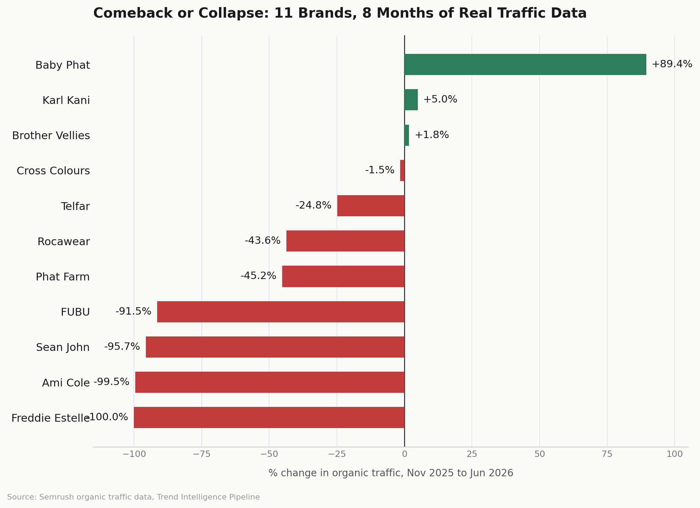

# Trend Intelligence Pipeline

### Issue 001. Black-Owned Fashion & Beauty Brands

This started as a school impact analysis on FUBU, a brand that went from over $6 billion in total retail sales to withdrawing from the U.S. market by 2003, largely from overbuying and failing to evolve. FUBU is now eyeing a comeback. The paper raised a question that couldn't be answered by reading press coverage alone: is renewed interest backed by real demand, or is it nostalgia and hype?

This pipeline is the repeatable answer to that question. It's a small, real AI engineering pipeline. It takes raw search traffic data, computes trend metrics in plain Python (no AI, so the numbers can't be hallucinated), then sends only those computed metrics to Claude to interpret: direction, confidence, and a clearly labeled hypothesis for why. Output is a single markdown report. Same brands, same real Semrush data, but running as a script instead of asking one question at a time.

*This analysis was later applied creatively. See the [FUBU Reimagined case study](https://angel-holmes-portfolio.vercel.app) for the full design and campaign project that grew out of it.*

---

## What's in this folder

```
trend-pipeline/
├── data/
│   └── brand_traffic.csv       # seed dataset: 11 brands, monthly organic traffic, Nov 2025-Jun 2026
├── trend_pipeline.py           # the pipeline itself
├── output/
│   └── trend_report.md         # generated when you run the script
└── README.md
```

## Setup

```bash
pip install anthropic
export ANTHROPIC_API_KEY="sk-ant-your-key-here"
```

Get a key at console.anthropic.com if you don't have one yet.

## Run it

```bash
python trend_pipeline.py
```

You'll see progress printed per brand, then a full report written to `output/trend_report.md`.

## How the pipeline is structured (and why it counts as AI engineering)

1. **`load_traffic_data()`**: reads the CSV, groups by brand, sorts chronologically. Pure data handling, no AI.
2. **`compute_metrics()`**: calculates % change, peak month, and a spike detector (any month-over-month move of 40% or more). Still no AI. This is the part that has to be trustworthy, so it's just math.
3. **`analyze_brand()`**: the only step that touches Claude. It sends the computed metrics, not raw opinions, not the CSV, and constrains the response to a strict JSON schema: trend direction, confidence, headline, a hypothesis labeled as a hypothesis, and what to check next run.
4. **`build_report()`**: assembles everything into one markdown file.

This split is the actual engineering decision worth explaining in a portfolio case study. The AI never sees raw numbers it could restate wrong, and it never gets to invent a narrative without labeling it as speculation.

## Findings

The first version of this report named 3 brands (Baby Phat, FUBU, Ami Colé) as the headline cases. The seed dataset actually covers all 11 brands from Nov 2025 to Jun 2026, and the full run tells a sharper story:

| Brand | % Change | Read |
|---|---|---|
| Baby Phat | +89.4% | Strongest sustained comeback |
| Karl Kani | +5.0% | Flat, mild upward drift |
| Brother Vellies | +1.8% | Essentially flat |
| Cross Colours | -1.5% | Essentially flat |
| Telfar | -24.8% | Notable pullback for a brand of its scale |
| Rocawear | -43.6% | Clear decline |
| Phat Farm | -45.2% | Clear decline |
| FUBU | -91.5% | Hype vs. demand cautionary tale, matching the overbuying/no-evolution pattern from the original impact analysis |
| Sean John | -95.7% | Near-total collapse |
| Ami Colé | -99.5% | Traffic collapse visible in the data ahead of the brand's public closure |
| Freddie Estelle | -100.0% | Traffic went to zero by the end of the window |



## Making it fully live

Right now `load_traffic_data()` reads the seed CSV pulled from Semrush's `resource_rank_history` report during research. To automate data collection too, swap that function for a live call to Semrush's API (needs your own Semrush API key), shaped into the same per-row structure. Nothing else in the pipeline has to change. That's the point of keeping data loading separate from analysis.

## Extending it

- Add more brands: append rows to `brand_traffic.csv` in the same format.
- Add more months: same, one row per brand per month.
- Change the AI's focus: edit `SYSTEM_PROMPT` in `trend_pipeline.py`. For example, ask it to flag brands worth a retail partnership pitch, or brands showing early decline before it's public news (see: Ami Colé in the seed data).

---

*Built by Angel Holmes. The full creative application of this analysis, including the FUBU Reimagined design boards and the Akara x FUBU campaign photos and video, is documented separately at [angel-holmes-portfolio.vercel.app](https://angel-holmes-portfolio.vercel.app).*
